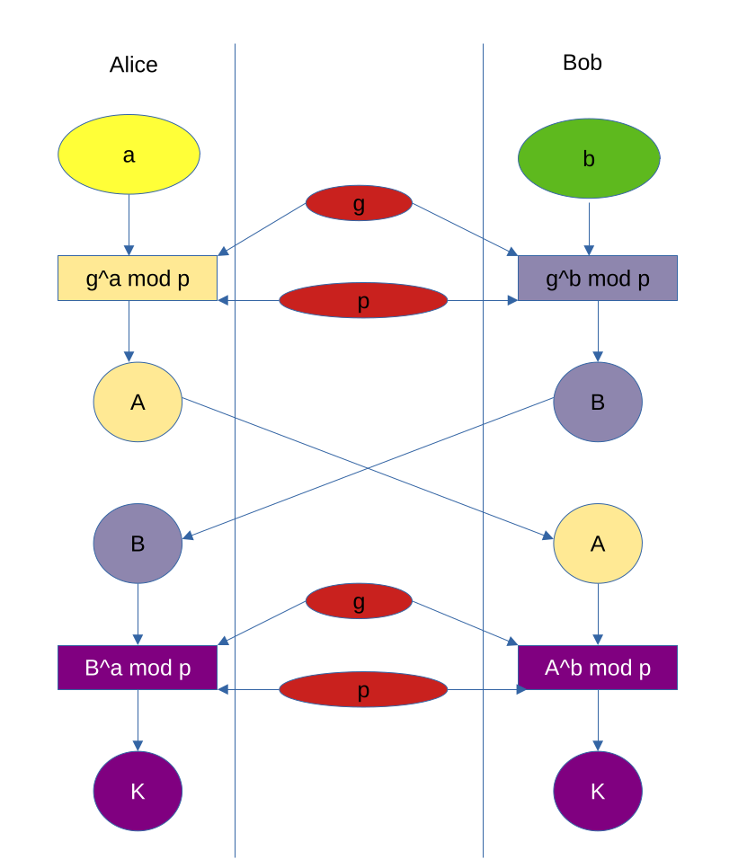

[back](encryption.md)

# Diffie-Helman Key Exchange

## Symmetric Encryption

The Diffie-Helman Key Exchange facilitates generating a shared secret key
between 2 or more parties over an unsecured network.  Traditionally, the users
Alice and Bob are used to illustrate the process, just think of Alice being your
computer and Bob being a Server you wish to communicate with.

1. Agreement is made between Alice and Bob on a large prime number (>1k bits),
   and a small prime number (<23).  The small number is called the generator,
   and is denoted `g`.  The large number is prime and denoted `p`.  This
   agreement is not only known to both Alice and Bob but also to any
   eavesdropper as it is made 'in clear' over the unsecured network.

2. Alice generates a secret integer, which we'll denote as `a`.  She computes
   `g^a mod p`, the result of which we'll denote as `A`.  She sends Bob `A`.

3. Bob generates a secret integer, which we'll denote as `b`.  He computes `g^b
   mod p`, the result we'll call 'B', which he sends back to Alice.

4. (this is magical, elegant bit). Alice computes `B^a mod p` and Bob computes
   `A^b mod p` - the result of both of those calculations are equal (and can be
   proven mathematically).  They have now generated a shared secret key, which
   they both know, but no-one else does.  They use this key to encrypt further
   communication. As they are using the same key to encrypt and decrypt this is
   called Symmetric Encryption.

Any eavesdropper will know `A`, `B`, `p` and `g` but will never know `a` or `b`.
For all intents and purposes `A` and `B` can be brute-forced (trying each
combination in turn) to extract `a` and `b`, but, to do so has been calculated
to take an enormous amount of time (multiple human lifetimes, so Alice and Bob
will be long gone).

The
[wikipedia](https://en.wikipedia.org/wiki/Diffie%E2%80%93Hellman_key_exchange)
page does illustrate this process using colour mixing, but then goes on to
explain the mathematics behind the method in as obscure a way as possible much
like a Regimental Sargent Major bellowing a Shakespeare Sonnet. This video from
[Computerphile](https://www.youtube.com/watch?v=NmM9HA2MQGI) shows the colour
mixing in action with [this one](https://www.youtube.com/watch?v=Yjrfm_oRO0w)
explaining the mathematics.

[back](encryption.md)
