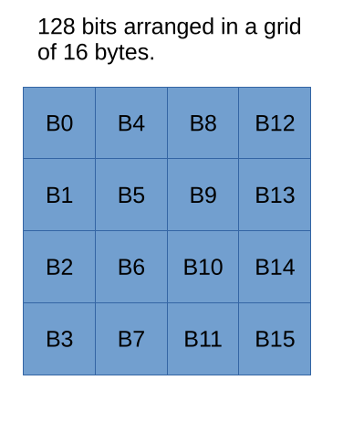
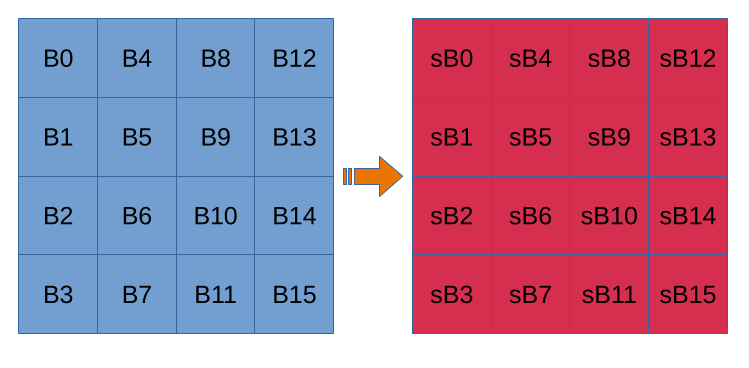
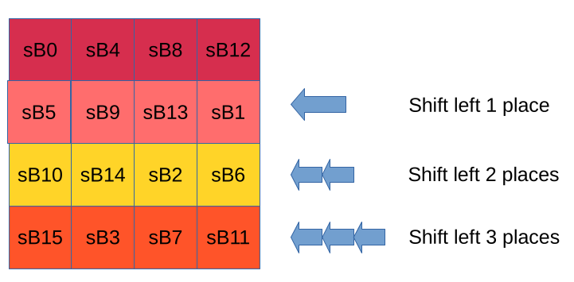
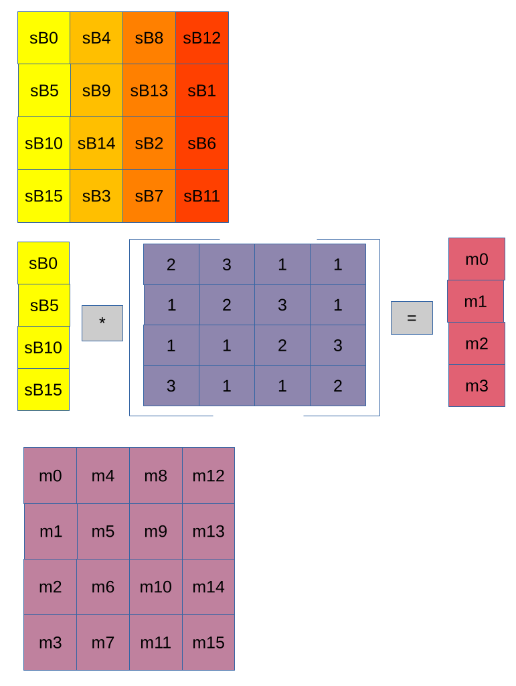
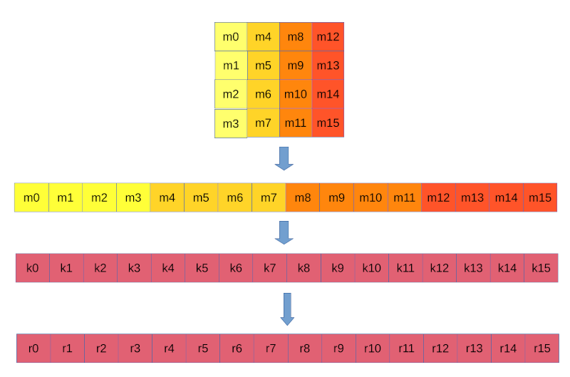

[back](index.md)

# Advanced Encryption Standard

After a competition to find a 'good enough' encryption standard the Rijndael
Cypher was chosen to become the Advanced Encryption Standard.

AES is a 128 bit symmetric block cypher, which means that the incoming message
is split up into blocks of 128 bits.  Each of those blocks are then operated on
and the resulting output cypher text is also 128 bits long. i.e. the encrypted
message size is normally the same size as the input message.

The key size for AES is 128, 192 or 256 bits in length, which will give
increasing levels of security at the cost of processing time. The smallest key
size of 128 bits still gives a theoretical brute force time measured in billions
of years to crack AES.




AES performs a number of encryption rounds, each one consisting of key
insertion, substitution, permutation to shift rows in the grid, permutation to
mix columns in the grid and finally add the round key.

The last round does everything above except mix columns.

The number of rounds depends on the key size. 128 bits = 10 rounds, 192 = 12
rounds and 256 = 14 rounds.


## Substitution

The S-Box used for AES is cleverly designed such that there are no inversions
nor inverted mappings.  i.e. `10101010` doesn't map to `01010101` nor if
`10101010` maps to `11001100` then `11001100` will not map to `10101010`.  As it
is just a lookup table, it is very fast to implement (in computing terms of
speed). See [Rijndael S-Box](https://en.wikipedia.org/wiki/Rijndael_S-box)



## Permutations

### Shift Rows

The top row of the grid remains unchanged.

The 2nd row is shifted left one place, so `sB1` moves to where `sB13` is and the
others in that row move left one.

The 3rd row is shifted left two places.

The 4th row is shifted left three places (which is shifting right by one place).



### Mix Columns

Each column in turn is multiplied with a pre-defined matrix. Any single value
that exceeds the value of a byte once each one has been added up is modded back
to be within a single byte.  Thus each column after the mixing is returned as a
single column.  The diagram shows only the first column however each column is
mixed in turn to produce the final grid.



```
(sB0 * 2) + (sB0 * 1) + (sB0 * 1) + (sB0 * 3) == m0
(sB5 * 3) + (sB5 * 2) + (sB5 * 1) + (sB5 * 1) == m1
(sB10 * 1) + (sB10 * 3) + (sB10 * 2) + (sB10 * 1) == m2
(sB15 * 1) + (sB15 * 1) + (sB15 * 3) + (sB15 * 2) == m3
```

### Round Key

The next block of 128 bits from the key stream is then Xored with the result.



To produce the input message for the next round.  After the final round the
output is the encrypted message.

## Decryption

Decryption is the reverse of the above.  Each step is reversible, and thus, the
message is decryptable.


[back](index.md)
