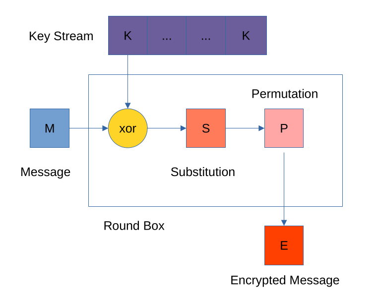

[back](index.md)

# Substitution and Permutation

## Substitution

A lookup table that maps an input value to an output value. Often called an
S-Box.

## Permutation

The permutation block jumbles the incoming `bits` in a known way.

In most forms of symmetric encryption there will be a number of different
permutations available.

## Round

Taken together a Substitution and Permutation process is known as a round.

## Block Cypher

As both the substitution and permutation phases work in blocks of a finite size
most encryption based on SP networks are known as Block Cyphers.

## Key Expansion

Both the substitution look up table and the permutation blocks are published as
part of the encryption standard.  To make the encryption as 'unbreakable' as
possible a 3rd element is required.  This is the encryption key, a large number
of a fixed size, 1024 bits plus.

The key is mixed into the SP rounds, using XOR so it is reversible, and to
ensure that there are enough bits of the key it is expanded to the size of each
round.

The key is split up into 32-bit words, the first 3 are simply repeated, the 4th.
is put through an S-Box and Permutation different to the Round phases and added
to what is now a Key Stream.

The Key Stream is cut into blocks of the same size as each Round.

[back](index.md)
