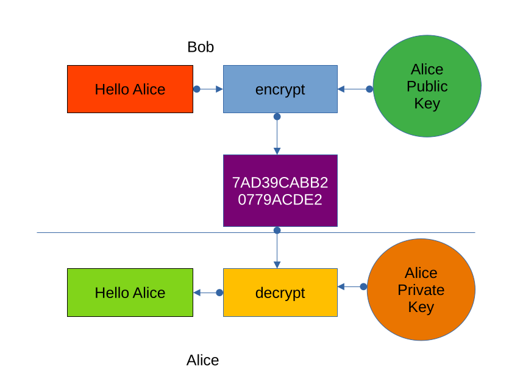

[back](encryption.md)

# Public Private Key Encryption

## Asymmetric Encryption

A user generates an RSA key pair - basically 2 encryption keys with a subtle
relationship, whereby anything encrypted with one key can be decrypted with the
other, and vica-versa.

One key is made public, shared with the world, the other is kept private, known
only to the user.  That last part is extremely important, as should the private
key become known to anyone/thing else then the security of the key pair is
compromised and they should be discarded and new ones generated.

## Bob and Alice

1. Bob wants to send a message, "Hello Alice", to Alice.
2. He encrypts the message using Alice's public key.
3. He sends the encrypted message over the insecure network to Alice.
4. Alice receives the message and decrypts it using her private key, "Hello
   Alice"

## Signatures

When using other forms of encryption (or even in-clear messaging) a signature of
the message can be generated [(see hashing functions in
wikipedia)](https://en.wikipedia.org/wiki/Hash_function) that is encrypted with
the private key.  A receiver of the message can then attempt to decrypt the
signature with the public key, and by recomputing the hash of the message can be
sure that the message hasn't been tampered with and that it came from the person
it said it came from as only that person has the private key of the key pair.

## GPG (PGP)

[GPG (GNU Privacy Guard)](https://gnupg.org/https://gnupg.org/) based on [Phil
Zimmerman's](https://philzimmermann.com/EN/background/index.html) PGP (Pretty
Good Privacy) - I'll link to [openpgp](https://www.openpgp.org/) as I can't find
the original, is one use of PPK encryption.  The private key is called the
Secret Key in GPG and the public part is called the GPG public key.  Using GPG
you can encrypt messages, blocks of text or even whole files (or collections of
files as in zips and tar files).  Using the recipients public key  to encrypt
the message ensures that only they can decrypt it (using their private or secret
key).

GPG extends this a little further, by using 'Slot' encryption (my term, I have
no idea what the correct mathematical terminology is, this [Stack
Overflow](https://stackoverflow.com/questions/38846/how-to-encrypt-one-message-for-multiple-recipients)
answer may take you on that journey) allows you to encrypt the same message for
numerous recipients at the same time, such that each one will be able to decrypt
it using their specific private key.

[back](encryption.md)
